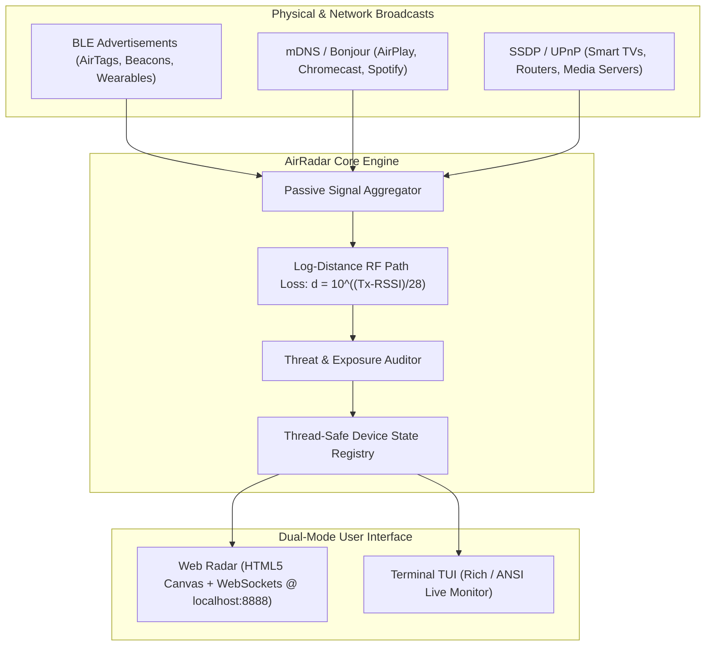

# 📡 AirRadar (`air-radar`)

<div align="center">

```
   _____  .__      __________             .___            
  /  _  \ |__|____ \______   \_____     __| _/____ _______
 /  /_\  \|  \__  \ |       _/\__  \   / __ |\__  \\_  __ \
/    |    \  |/ __ \|    |   \ / __ \_/ /_/ | / __ \|  | \/
\____|__  /__|____  /____|_  /(____  /\____ |(____  /__|   
        \/        \/       \/      \/      \/     \/       
```

### **Passive Wireless, BLE & IoT Broadcast Environment Radar**

[](https://opensource.org/licenses/MIT)
[](https://www.python.org/)
[](#features)
[](#privacy--security-scorecard)

*Expose the invisible digital airwaves around you in real time.*

</div>

---

## ⚡ Overview

Every second, the space around you is saturated with invisible wireless broadcasts: **Apple AirTags & FindMy beacons, smartwatches, AirPods, Philips Hue bridges, Chromecast/AirPlay nodes, and unencrypted IoT devices**.

**AirRadar** transforms your machine into a real-time tactical physical broadcast radar. It passively intercepts Bluetooth Low Energy (BLE), Multicast DNS (mDNS/Bonjour), and SSDP/UPnP signals, calculates proximity via logarithmic RF path-loss models, and projects active devices onto an interactive **Sci-Fi Radar Screen** or a **Live Terminal Dashboard**.

---

## ✨ Features

- 🛰️ **Dual-Mode UI Engine:**
  - **Sci-Fi Web Radar (`--web`):** 60 FPS HTML5 Canvas with continuous rotating phosphorescent sweep, distance rings, pulsating signal blips, and synthesized audio pings.
  - **Live Terminal TUI (`--tui`):** Clean ANSI/Rich dashboard displaying active signals, vendors, signal strengths, and threat levels.
- 📡 **Multi-Protocol Wireless Capture:**
  - **BLE Proximity & Beacon Hunter:** Detects Apple AirTags, FindMy beacons, Tile tags, smartwatches, and headphones with RSSI distance estimation.
  - **ZeroConf / Bonjour (mDNS):** Intercepts AirPlay, Chromecast, Spotify Connect, and local web services.
  - **SSDP / UPnP Broadcaster:** Maps Smart TVs, Routers, and NAS media servers.
- 🛡️ **Privacy & Physical Security Audit:**
  - Flags unknown tracking beacons following you over time.
  - Identifies cleartext services (unencrypted HTTP/FTP/Telnet) broadcasting to your local network.
  - Calculates a real-time **Environmental Privacy & Exposure Score (0–100)**.
- 🎮 **Built-in Simulation Demo Mode (`--demo`):** Test and explore full radar functionality immediately without needing physical Bluetooth hardware or permissions.
- 🔒 **100% Offline & Private:** Zero cloud telemetry, zero external network requests.

---

## 🏗️ Architecture



---

## 🚀 Quick Start

### 1. Installation

Clone the repository and install dependencies:

```bash
git clone https://github.com/your-username/air-radar.git
cd air-radar
pip install -e .
```

> *(AirRadar also runs with zero external dependencies in standard Python using fallback engines!)*

### 2. Launch Web Radar

```bash
air-radar --web
```
Open **`http://localhost:8888`** in your browser to watch the live radar screen!

### 3. Launch Terminal TUI

```bash
air-radar --tui
```

### 4. Run Instant Simulation Demo

Don't have Bluetooth enabled or want to test in a quiet room?

```bash
air-radar --web --demo
```

---

## 🛠️ CLI Options

| Flag | Description |
| :--- | :--- |
| `--web` | Launch the Sci-Fi Web Radar UI at `http://localhost:8888` *(default)* |
| `--tui` | Launch the live Terminal TUI monitor |
| `--demo` | Run in simulation mode with realistic synthetic wireless signals |
| `--port <port>` | Specify custom web server port (default: `8888`) |
| `--host <host>` | Specify custom web server host (default: `127.0.0.1`) |
| `--no-ble` | Disable Bluetooth Low Energy scanning |
| `--no-mdns` | Disable mDNS / Bonjour scanning |
| `--no-ssdp` | Disable SSDP / UPnP scanning |
| `--export <file>` | Export captured device telemetry to a JSON file upon exit |

---

## 🔬 How Distance Estimation Works

AirRadar uses the **Log-Distance Path Loss Model** to calculate physical distance from RSSI (Received Signal Strength Indicator):

$$d = 10^{\frac{\text{TxPower} - \text{RSSI}}{10 \cdot n}}$$

- $\text{TxPower}$: Calibrated reference signal strength at 1 meter (typically $-59\text{ dBm}$).
- $\text{RSSI}$: Measured signal strength in $\text{dBm}$.
- $n$: Environmental path loss exponent ($2.0$ for open air, $2.8$ for indoor environments with walls).

---

## 🧪 Running Tests

Run the test suite with `pytest`:

```bash
pytest
```

---

## 📄 License

This project is licensed under the **MIT License** — see the [LICENSE](LICENSE) file for details.
